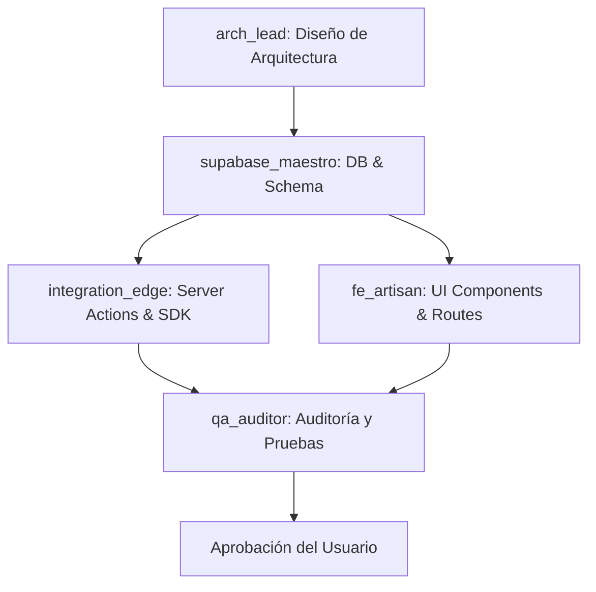

# Especificación de Arquitectura y Plan de Ejecución: MFTS (Mat Fleet Tech Services)

Este documento detalla la arquitectura de software, estructura de carpetas, mapa de rutas, modelo de datos y plan de trabajo modular para la implementación del sitio web de **Mat Fleet Tech Services (MFTS)**.

---

## 1. Stack Tecnológico de Referencia

*   **Framework:** Next.js 16.2.6 (App Router)
*   **Lenguaje:** TypeScript 5.x
*   **Base de Datos / Backend-as-a-Service:** Supabase (PostgreSQL)
*   **Estilos:** Tailwind CSS v4 (usando directiva `@import "tailwindcss"` y bloques `@theme` en `globals.css`)
*   **Animaciones:** Framer Motion 12.x
*   **Iconos:** `@phosphor-icons/react` 2.x

---

## 2. Mapa de Rutas e Interacciones

La aplicación web consta de 5 rutas principales organizadas mediante Next.js App Router:

| Ruta | Componentes Clave | Tipo de Componente | Propósito |
| :--- | :--- | :--- | :--- |
| `/` | `Navbar`, `HeroSection`, `ServicesSection`, `Footer` | Server / Client (Mixto) | Landing page corporativa (Existente). |
| `/servicios` | `ServiceDetailSection`, `CTA` | Server Component | Detalle de los 6 servicios principales (Soporte IT, Redes, Mantenimiento, Seguridad/CCTV, Impresión, Microsoft 365) con anclas `#id`. |
| `/nosotros` | `StorySection`, `ValuesGrid`, `MissionVision` | Server Component | Información institucional (Misión, Visión, Valores, Quiénes Somos). |
| `/partner` | `MicrosoftPartnerHero`, `SolutionsGrid` | Server Component | Oferta de valor como Partner Oficial de Licenciamiento de Microsoft. |
| `/contacto` | `ContactForm` | Client Component (Interactivo) | Formulario de contacto con Server Action para la inserción de prospectos en Supabase. |
| `/agents` | `AgentsDashboard` | Server/Client (Mixto) | Panel interactivo que renderiza `antigravity.config.json` con diseño premium de glassmorphism y animaciones. |

---

## 3. Estructura de Directorios Propuesta

Para mantener el proyecto modular, ordenado y alineado con los estándares del App Router, se utilizará la siguiente estructura:

```text
src/
├── app/
│   ├── layout.tsx                # Layout principal (Existente)
│   ├── page.tsx                  # Home landing page (Existente)
│   ├── globals.css               # Estilos globales y tema Tailwind v4 (Existente)
│   ├── servicios/
│   │   └── page.tsx              # Página detallada de los 6 servicios (Nuevo)
│   ├── nosotros/
│   │   └── page.tsx              # Página de Quiénes Somos, Misión, Visión (Nuevo)
│   ├── partner/
│   │   └── page.tsx              # Página de soluciones Microsoft Partner (Nuevo)
│   ├── contacto/
│   │   ├── page.tsx              # Contenedor de la página de contacto (Nuevo)
│   │   └── actions.ts            # Server Action para envío de formulario a Supabase (Nuevo)
│   └── agents/
│       └── page.tsx              # Server Component que lee antigravity.config.json (Nuevo)
├── components/
│   ├── Navbar.tsx                # Barra de navegación (Existente)
│   ├── Footer.tsx                # Pie de página (Existente)
│   ├── ContactForm.tsx           # Formulario interactivo con React 19 hooks (Nuevo)
│   ├── GlassCard.tsx             # Contenedor reutilizable estilo Glassmorphism (Nuevo)
│   └── AgentsDashboard.tsx       # UI interactiva para la ruta /agents con animaciones (Nuevo)
├── lib/
│   └── supabase.ts               # Inicialización del cliente Supabase (Nuevo)
└── types/
    └── index.ts                  # Tipados compartidos de la aplicación (Nuevo)
```

---

## 4. Diseño del Modelo de Datos (Supabase)

El agente `supabase_maestro` implementará el siguiente esquema en PostgreSQL. 

### Enums y Tablas (SQL)

```sql
-- 1. Crear tipo ENUM para servicios de interés
CREATE TYPE mfts_service_type AS ENUM (
  'soporte',
  'redes',
  'mantenimiento',
  'seguridad',
  'impresion',
  'microsoft'
);

-- 2. Crear tipo ENUM para estados de la solicitud
CREATE TYPE submission_status AS ENUM (
  'new',
  'in_progress',
  'resolved',
  'archived'
);

-- 3. Crear tabla de contactos
CREATE TABLE contact_submissions (
  id UUID DEFAULT gen_random_uuid() PRIMARY KEY,
  name TEXT NOT NULL,
  email TEXT NOT NULL,
  company TEXT,
  phone TEXT,
  service_interest mfts_service_type NOT NULL,
  message TEXT NOT NULL,
  status submission_status DEFAULT 'new' NOT NULL,
  created_at TIMESTAMPTZ DEFAULT now() NOT NULL
);

-- 4. Habilitar Seguridad a Nivel de Fila (RLS)
ALTER TABLE contact_submissions ENABLE ROW LEVEL SECURITY;

-- 5. Política para permitir inserciones públicas (Formulario público de contacto)
CREATE POLICY "Permitir inserción pública anónima" 
  ON contact_submissions 
  FOR INSERT 
  WITH CHECK (true);

-- 6. Política para permitir lectura y actualización únicamente a usuarios autenticados (Panel administrador)
CREATE POLICY "Permitir lectura y edición a administradores autenticados"
  ON contact_submissions
  FOR ALL
  TO authenticated
  USING (true)
  WITH CHECK (true);
```

---

## 5. Diseño del Panel de Agentes (`/agents`)

El panel de control interactivo leerá el archivo de configuración en el servidor y delegará el renderizado interactivo al cliente para no violar el paradigma de Server Components vs Client Components.

### Paso 1: Componente Servidor (`src/app/agents/page.tsx`)
*   **Función:** Lee `antigravity.config.json` usando el módulo `fs` de Node.js de forma asíncrona.
*   **Propiedades:** Define `export const revalidate = 0` para asegurar que cada carga obtenga el estado en tiempo real del archivo de configuración.

```typescript
import fs from 'fs/promises';
import path from 'path';
import AgentsDashboard from '@/components/AgentsDashboard';

export const revalidate = 0;

export default async function AgentsPage() {
  try {
    const configPath = path.join(process.cwd(), 'antigravity.config.json');
    const fileContent = await fs.readFile(configPath, 'utf-8');
    const config = JSON.parse(fileContent);

    return <AgentsDashboard config={config} />;
  } catch (error) {
    return (
      <div className="flex min-h-screen items-center justify-center bg-zinc-950 text-white p-6">
        <div className="max-w-md w-full bg-zinc-900 border border-red-500/30 p-8 rounded-3xl text-center">
          <h1 className="text-xl font-bold text-red-400 mb-2">Error de Configuración</h1>
          <p className="text-zinc-500">No se pudo leer el archivo antigravity.config.json.</p>
        </div>
      </div>
    );
  }
}
```

### Paso 2: Componente Cliente Animado (`src/components/AgentsDashboard.tsx`)
*   **Función:** Utiliza `framer-motion` y Tailwind CSS v4 para crear una interfaz estilo **glassmorphism** oscura/cyberpunk premium.
*   **Visualizaciones:**
    *   **Encabezado:** Nombre del Workspace y Versión.
    *   **Secuencia de Pipeline:** Un flujo interactivo que ilustra la secuencia de ejecución (`arch_lead -> supabase_maestro -> fe_artisan + integration_edge -> qa_auditor -> user_approval`).
    *   **Tarjetas de Agentes:** Tarjetas semitransparentes con bordes sutiles y efectos de desenfoque de fondo (`backdrop-blur-xl bg-zinc-900/40 border border-zinc-800/80`). Al hacer click sobre un agente, se despliega en un panel lateral o modal detallado sus herramientas y su prompt del sistema.
    *   **Estado del Workspace:** Listado visual de las carpetas/archivos principales del proyecto que refleja la salud y actividad del entorno de desarrollo.

---

## 6. Plan de Ejecución Modular por Agentes

El flujo de desarrollo sigue un pipeline ordenado de entrega continua basado en las especificaciones de `antigravity.config.json`:



### Fase 1: Base de Datos (Responsabilidad: `supabase_maestro`)
1.  **Script SQL:** Crear archivo de migración en la base de datos de Supabase ejecutando la creación del tipo enum `mfts_service_type`, `submission_status`, la tabla `contact_submissions`, activando RLS y creando las políticas correspondientes.
2.  **Validación de Esquema:** Validar que las políticas RLS funcionen correctamente y documentar el esquema de BD.

### Fase 2: Lógica de Negocio e Integraciones (Responsabilidad: `integration_edge`)
1.  **Instalar dependencias necesarias:** Agregar `@supabase/supabase-js` a `package.json` si no está instalado.
2.  **Cliente Supabase:** Crear `src/lib/supabase.ts` para inicializar el cliente utilizando variables de entorno seguras (`NEXT_PUBLIC_SUPABASE_URL` y `NEXT_PUBLIC_SUPABASE_ANON_KEY`).
3.  **Server Action (`src/app/contacto/actions.ts`):** 
    *   Crear función asíncrona `'use server'` para procesar el formulario de contacto.
    *   Validar datos (preferiblemente con tipado manual o Zod).
    *   Realizar inserción en la tabla `contact_submissions`.
    *   Retornar objeto de estado `{ success: boolean, message: string }`.

### Fase 3: Construcción de Interfaces y Navegación (Responsabilidad: `fe_artisan`)
1.  **Crear Rutas del Sitio:**
    *   `src/app/servicios/page.tsx`: Diseñar con secciones detalladas con ID (`#soporte`, `#redes`, etc.) de los 6 servicios corporativos. Usar layouts limpios y modernos, con iconos Phosphor y colores de la paleta.
    *   `src/app/nosotros/page.tsx`: Estructura limpia y responsiva para Misión, Visión, Valores con animaciones sutiles de entrada.
    *   `src/app/partner/page.tsx`: Sección corporativa premium enfocada en soluciones Microsoft (M365, Teams, Licenciamiento).
2.  **Crear Formulario interactivo (`src/components/ContactForm.tsx`):**
    *   Usar `"use client"`.
    *   Implementar el hook de React 19 `useActionState` para manejar el estado del Server Action (errores, cargando, éxito).
    *   Estilos responsivos con Tailwind CSS v4, animaciones con Framer Motion, y validación visual instantánea.
3.  **Crear Interfaz del Panel (`src/components/AgentsDashboard.tsx`):**
    *   Implementar un diseño visualmente sobresaliente (Fondo oscuro, degradados sutiles en movimiento, tarjetas estilo vidrio flotante).
    *   Visualizar la secuencia de trabajo interactiva de los agentes (`arch_lead`, `supabase_maestro`, etc.).
    *   Asegurar compatibilidad absoluta con Framer Motion y Tailwind CSS v4.

### Fase 4: Aseguramiento de Calidad y Pruebas (Responsabilidad: `qa_auditor`)
1.  **Validación de Typescript:** Asegurar que no existan tipos `any` implícitos ni explícitos no seguros.
2.  **Verificación de Lints:** Correr `pnpm run lint` y verificar que el proyecto compile de forma limpia y sin advertencias.
3.  **Pruebas de Componentes:** Asegurar que no haya errores de hidratación (Hydration Errors) al utilizar componentes de cliente y servidor cruzados.
4.  **Paradigmas de Rendering:** Validar que los componentes interactivos lleven `"use client"` estrictamente en la primera línea de archivo y que los Server Components no utilicen hooks del cliente.

---

## 7. Directrices Críticas de Desarrollo (React 19 & Next.js 16)

*   **Parámetros dinámicos en Páginas/Layouts:** En Next.js 16/15, los objetos `params` y `searchParams` en las funciones de páginas y layouts se comportan como **Promises** y deben ser esperados asíncronamente antes de leer sus propiedades.
    *   *Incorrecto:* `const id = params.id;`
    *   *Correcto:* `const { id } = await params;`
*   **Manejo de Formularios en React 19:** Reemplazar el antiguo `useFormState` por el hook nativo de React 19 `useActionState`.
    *   Sintaxis base: `const [state, formAction, isPending] = useActionState(yourServerAction, initialState);`
*   **Estilo con Tailwind CSS v4:**
    *   Los archivos CSS no requieren directivas antiguas de Tailwind. Solo se usa `@import "tailwindcss";`.
    *   Las variables del tema se extienden dentro del bloque `@theme { ... }` en `src/app/globals.css`.
